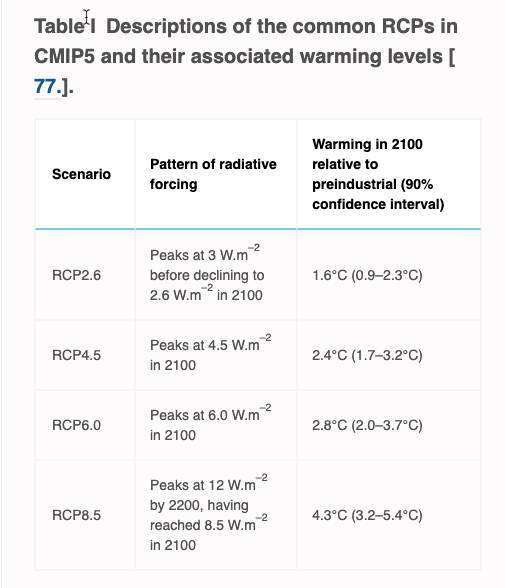
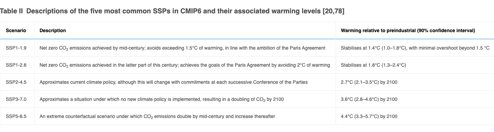
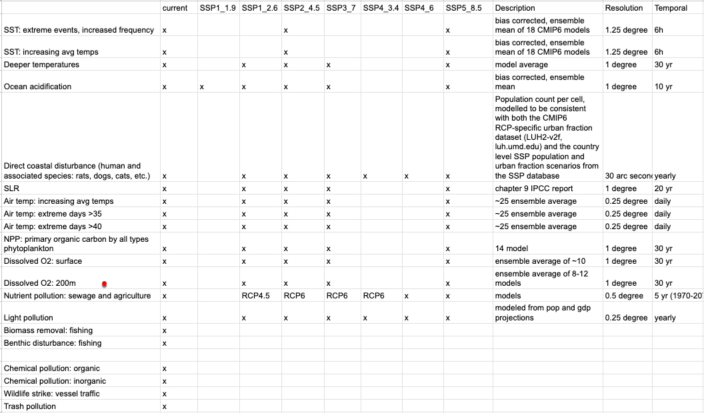
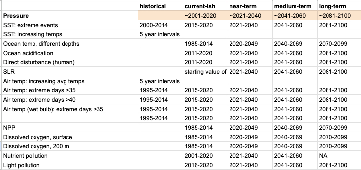

```{r, echo=FALSE, include=FALSE, message=FALSE}

library(terra)
library(tidyverse)
library(rasterVis)
library(here)
library(lattice)
color_ramp <- c("#87BCC5", "#90A2B6", "#978BA8", "#9F769B", "#A85B8B", 
  "#B14274", "#C13827", "#DA5B27", "#FCEF18")

color_ramp <- colorRampPalette(color_ramp, space="Lab")(100)

rast_base_10km_file <- terra::rast(here('_spatial/rast_base_mol_10km.tif'))
```

## Introduction
Marine environments face increasing pressures given increasing population and escalating demands for food (fisheries and mariculture), recreation, transportation, and resource extraction. Climate change is also dramatically altering the temperature and chemistry of ocean waters. The sustainability of marine environments hinges upon understanding the consequences of human actions on marine environments. 

Significant progress has been made over the past two decades in identifying, assessing, and mapping the cumulative impacts of human activities on marine species, communities and ecosystems (1, 3, 4). This work has shown dramatically that no part of the ocean remains untouched by human stressors (5) and that assessments of single stressors do not capture how and where the combination of stressors impacts ocean ecosystems. Cumulative impact assessments are critical for understanding the state of biodiversity and developing strategic management and conservation interventions. 

This body of research helps inform the current status of biodiversity, but not what the future may hold given a world of increasing intensity and diversity of human stressors on the ocean. In short, what is missing is a forecast of how human activities will cumulatively impact marine biodiversity in the future. With such forecasting capability, scientists, managers and policy makers would be armed with a critical tool to prioritize and develop relevant management action.

To further these efforts, we have compiled data describing future pressures, for different scenarios, on marine environments to understand which regions face the largest cumulative pressures in future years. This information will help us, as well as other researchers, predict the future impacts of anthropogenic stressors.

## Climate scenarios

Climate research has developed a useful framework for exploring how future climate might evolve based on different paths that human civilization might take. This approach captures some of the uncertainty we have given the possible range of future scenarios for social, political, and economic outcomes. This framework is also useful for non-climate pressures, and we have used it to structure our data.    

CMIP Phase 6 (i.e., Coupled Model Intercomparison Project) is the most recent large-scale effort to estimate future climate projections, and is best known for producing the outputs used in the IPCC’s (Intergovernmental Panel on Climate Change) sixth assessment report. This tremendous effort, coordinated by the World Climate Research Progam (WCRP), brings together independent climate modeling groups around the world (about 53 groups) to produce climate models based on a standardized framework.

These institutions use general circulation models that represent physical processes in the atmosphere, ocean, and land surface to produce historical (1850-2014) and future climate projections (2015-2100). 


CMIP6 includes eight different scenarios of how climate might evolve in the future given different possible scenarios of human development and greenhouse gas emission pathways. These scenarios combine two frameworks: the Shared Socioeconomic Pathway (SSP, first part of the scenario name) and the Representative Concentration Pathway (RCP, second part of the scenario name). Shared Socioeconomic Pathways (SSPs) are narratives describing 5 potential pathways of global socioeconomic development, based on variables such as population, technological advancements, climate policies, and gross domestic product. These storylines are then paired with greenhouse gas emission pathways (RCPs) which result in specified levels of radiative forcing (i.e., difference between the amount of energy entering and leaving the atmosphere) in 2100.

An SSP scenario may have multiple potential RCPs. The most common are: SSP1-1.9, SSP1-2.6, SSP2-4.5, SSP3-7.0, SSP5-8.5.

Shared socioeconomic pathways (SSPs, https://www.cell.com/trends/ecology-evolution/fulltext/S0169-5347(23)00085-X):

* SSP1 Sustainability: the world shifts gradually toward a more sustainable path, emphasising more inclusive development that leads to lower levels of resource and energy use.

* SSP2 Middle of the Road: historical patterns of social, economic, and technological change are maintained, leading to a slow decline in the intensity of resource and energy use.

* SSP3 Regional Rivalry: an increasingly domestic focus leads to slow economic development with material-intensive consumption.

* SSP4 Inequality: greater social inequality evolves among societies, with different countries employing a mixture of low- and high-carbon energy sources.

* SSP5 Fossil-fuelled Development: the push for economic and social development is linked to the exploitation of fossil fuels and the adoption of resource- and energy-intensive lifestyles around the world, leading to rapid growth and rampant greenhouse gas emissions.




## Pressures

We attempted to find data for 27 pressure categories. We generally attempted to map pressures (e.g., biomass extraction) rather than activities (e.g., fishing) because organisms most directly respond to pressures. Furthermore, cumulative impact studies are easier when looking at pressures because the units are equivalent. One complication of this approach is that activities, and not pressures, are often mapped (e.g., shipping, mariculture). In these cases, we can attempt to model the pressure from the activity or, alternatively, use it as a proxy for the pressure.

One of the limits of the data is that often the pressures do not include all the activities that contribute to the pressure. For this reason it is good to understand the linkages between activities and pressures (https://docs.google.com/spreadsheets/d/1VijDWMGrtXnGYEzj4t9nUKO0h5wh4amO/edit#gid=186939138).

Pressure | Activities  
-------- | ------------ 
Increasing ocean temperatures* | ghg emissions 
Increasing air temperatues** | ghg emissions 
Ocean acidification | ghg emissions 
Sea level rise | ghg emissions
Changes to net primary productivity | ghg emissions
Reductions in oxygen | ghg emissions
Changes in UV | ghg emissions (cloud-cover), ozone changes
Increasing light pollution | coastal development, oil rigs, marine vessels and infrastructure
Disease/pathogen risk | coastal development, waste management, increasing temperatures, mariculture
Excess nutrients/eutrophication/algal blooms | human wastewater, agriculture (manure, synthetic fertilizers, nitrogen fixing crops), mariculture, marine vessel discharges
Direct human disturbance | humans and associated species (e.g., racoons, dogs)
Debris ingestion | marine plastics
Entanglement risk | trash, fishing gear, mariculture gear, cables
Organic pollution | sewage (microplastics, pharmaceuticals), point sources (manufacturing, spills), mariculture, agriculture (pesticides/herbicides/antibiotics)
Inorganic pollution | urban-runoff, point sources (manufacturing, mining), ships
Biomass extraction | fishing, coastal harvesting
Changes to salinity | ghg emissions (changes to rainfall, tidal forcing)
Air turbulance | ghg emissions (changes to wind patterns)
Water turbulance | ghg emssions (typhoons, hurricanes)
Wildlife strikes: water | ships
Wildlife strikes: air | windmills (birds)
Noise pollution | vessel traffic, military, resource extraction
Turbidity changes | ghg emissions (changes to rainfall, productivity), land-use change in watershed
Habitat change/loss: benthic offshore | benthic destructive fishing, ghost gear, anchoring, vessel eddys, dredging, development
Habitat change/loss: coastal structures | built structures (ports, windmills), mariculture, hardening
Habitat change/loss: erosion | sea level rise, storms, sand harvesting
Non-indigenous species | marine vessel transport, mariculture, aquarium trade

\* includes categories of SST (average and extreme events), change in bottom temperature, change in water column temperature

** includes categories of extreme events (number of days > 35 or 40 C, dry and wet bulb temperatures)

We were able to get current and future estimates for 11 of the pressure categories (I am still going to assume I can get the fisheries stuff). These data included various scenarios and methodologies. Without future projections, we were able to map 14 pressures. Major data limitations include:

- locations of most coastal and marine structures (hardening, windmills, wave energy, coastal hardening) 
- a great deal of uncertainty in the location of mariculture
- freely available maps of vessel traffic and fisheries harvest
- changes in coastal storms have a great deal of uncertainty

More work could be done to understand pathways of land-based pollution (garbage, sewage, runoff) into the ocean. Current dispersal models are very simplistic.

Scenarios available for each pressure:


We analyzed four general time categories:


## Pressures

### Temperature

#### SST

##### Data
Bias-corrected CMIP6 global dataset for dynamical downscaling of the Earth’s historical and future climate (1979–2100) 

Xu, Z., Han, Y., Tam, C.-Y., Yang, Z.-L. & Fu, C. Bias-corrected CMIP6 global dataset for dynamical downscaling of the historical and future climate (1979–2100). Sci Data 8, 293 (2021). https://www.scidb.cn/en/detail?dataSetId=791587189614968832&dataSetType=personal (accessed Aug 9 2022)
 
##### Pressure description
* Average temperature in degrees C. Values are rescaled from 0-1 for each taxa based on their specific thermal performance.

* Average proportion of extreme weeks during a year. Extreme events are defined as weeks that exceed the historical (1979-2010) mean plus 2 standard deviations. These values are not further rescaled.

##### Overview
 
Climate change has altered the temperature regimes of our ocean, generally increasing temperatures in almost every part of the ocean. 

We used two general methods of estimating the intensity of temperature pressures. In some cases, we can compare the average annual temperature to each organism’s thermal preference or tolerance values. A temperature pressure layer can then be calculated for each taxa, with the pressure intensity relative to its physiology. For example, when the annual average temperature exceeds the organism’s observed thermal range, the rescaled pressure value might be one. We calculate the average temperature data for 5 year windows.  

We also calculate the temperature pressure intensity by determining how extreme the temperature is relative to a historical period. This approach is a more general measure of pressure that does not require knowing anything about each organism’s thermal physiology, and consequently, a single pressure layer is applied to all organisms. For this approach, we used the historical model data from 1979 to 2010 to calculate the historical mean and standard deviation for each week.  We then compared each week's modeled scenario data to the historical values to identify weeks with extreme temperatures. Extreme temperature weeks were defined as those where the modeled temperatures exceed the historical mean temperature plus two standard deviations. For each year we determine the proportion of weeks with exceedences.

Organisms will be differentially affected by climate induced changes in temperature based on the depth that they predominantly live. Even for the more extreme scenarios, the projected warming at depths >200 m is minimal (quantify this) and there is high uncertainty in these predictions. It might seem that for benthic and non-benthic taxa that do not live at the surface of the ocean, the temperatures at around the 100 m mark might be better.  However, SST is likely a good indicator of temperature change throughout the water column.  Furthermore, benthic species appear to respond to sea surface temperatures more than benthic temperatures (check Casey's refs).  For this reason, we only provide temperature pressure data estimated at sea surface. 

NOTE: SST pressures probably only apply to taxa that spend time at depths <200 m.  

Ocean temperatures can increase due to other activities such as cooling thermal power plants.  Point source of heat are likely significant in some regions, but the data for mapping these inputs does not exist. Currently, the temperature pressure data do not include these sources.

```{r sst, echo=FALSE}
sst_extremes <- list.files("/home/shares/ohi/stressors_2021/_dataprep/SST/final_extreme", full=TRUE)

plot_theme <- list(axis.line=list(lwd=0))

file <- "/home/shares/ohi/stressors_2021/_dataprep/SST/final_extreme/sst-extreme_NA_historical.tif"
levelplot(terra::rast(file), col.regions=color_ramp, at=seq(0, 1, by=0.01), margin=FALSE, scales=list(draw=FALSE), xlab=NULL, ylab=NULL, par.settings=plot_theme, main = gsub(".tif", "", basename(file)))

file <- "/home/shares/ohi/stressors_2021/_dataprep/SST/final_extreme/sst-extreme_ssp245_current.tif"
plot_a <- levelplot(terra::rast(file), col.regions=color_ramp, at=seq(0, 1, by=0.01), margin=FALSE, scales=list(draw=FALSE), xlab=NULL, ylab=NULL, par.settings=plot_theme, main = gsub(".tif", "", basename(file)))

file <- "/home/shares/ohi/stressors_2021/_dataprep/SST/final_extreme/sst-extreme_ssp245_near.tif"
plot_b <- levelplot(terra::rast(file), col.regions=color_ramp, at=seq(0, 1, by=0.01), margin=FALSE, scales=list(draw=FALSE), xlab=NULL, ylab=NULL, par.settings=plot_theme, main = gsub(".tif", "", basename(file)))

file <- "/home/shares/ohi/stressors_2021/_dataprep/SST/final_extreme/sst-extreme_ssp245_medium.tif"
plot_c <- levelplot(terra::rast(file), col.regions=color_ramp, at=seq(0, 1, by=0.01), margin=FALSE, scales=list(draw=FALSE), xlab=NULL, ylab=NULL, par.settings=plot_theme, main = gsub(".tif", "", basename(file)))

file <- "/home/shares/ohi/stressors_2021/_dataprep/SST/final_extreme/sst-extreme_ssp245_long.tif"
plot_d <- levelplot(terra::rast(file), col.regions=color_ramp, at=seq(0, 1, by=0.01), margin=FALSE, scales=list(draw=FALSE), xlab=NULL, ylab=NULL, par.settings=plot_theme, main = gsub(".tif", "", basename(file)))

plot_a
plot_b
plot_c
plot_d

```

#### Coastal air temperature

NOTE: Have data for wetbulb air temp..but it takes forever to run. Is this worth it? Probably more relevant than absolute temperature?

##### Data
[IPCC WGI Interactive Atlas] (https://interactive-atlas.ipcc.ch/regional-information#eyJ0eXBlIjoiQVRMQVMiLCJjb21tb25zIjp7ImxhdCI6OTc3MiwibG5nIjo0MDA2OTIsInpvb20iOjQsInByb2oiOiJFUFNHOjU0MDMwIiwibW9kZSI6ImNvbXBsZXRlX2F0bGFzIn0sInByaW1hcnkiOnsic2NlbmFyaW8iOiJzc3A1ODUiLCJwZXJpb2QiOiIyIiwic2Vhc29uIjoieWVhciIsImRhdGFzZXQiOiJDTUlQNiIsInZhcmlhYmxlIjoiVFgzNWJjIiwidmFsdWVUeXBlIjoiQU5PTUFMWSIsImhhdGNoaW5nIjoiU0lNUExFIiwicmVnaW9uU2V0IjoiYXI2IiwiYmFzZWxpbmUiOiJBUjUiLCJyZWdpb25zU2VsZWN0ZWQiOltdfSwicGxvdCI6eyJhY3RpdmVUYWIiOiJwbHVtZSIsIm1hc2siOiJub25lIiwic2NhdHRlcllNYWciOm51bGwsInNjYXR0ZXJZVmFyIjpudWxsLCJzaG93aW5nIjpmYWxzZX19)

Number of days with maximum temperature above 35 or 40 degrees Celsius (bias adjusted using ISIMIP3 method).

Units: days

ensemble averages:
ssp1-2.6 = 24 models
ssp3-7.0 = 19 models (only 35C)
ssp5-8.5 = 25 models

##### Pressure description
Data were rescaled to values between 0 and why by determining the yearly proportion of extreme days (>35C or > 40C) minus the yearly proportion of historical (1995-2014) days >35C/40C

##### Overview

Marine environments are complex because some taxa are affected by both air and water temperature. The environmental temperatures experienced by organisms in shallower, near coastal regions might be a combination of water and air temperatures. This is especially true if working with coarser resolution temperature data that does not do a great job of capturing coastal phenomenon.Organisms in intertidal zones or those associated with land will directly experience air temperatures.    


Note to mel: get older historical data (1960-1990) and consider 1995-2014 current! Do the same with SLR. Otherwise "current" is considered 0. Be sure to change negative values to zero. NOTE: have higher resolution data with more scenarios and control over the number of models...but takes forever to calculate, is it worth it for this variable?
```{r Tair, echo=FALSE}

air_extremes <- list.files("/home/shares/ohi/stressors_2021/_dataprep/T_air/ipcc_proportion_days_35C", full=TRUE)

plot_theme <- list(axis.line=list(lwd=0))

historic_loc <- "/home/shares/ohi/stressors_2021/_dataprep/T_air/ipcc_proportion_days_35C/days-35_NA_historical.tif"
historic_raster <- rast(historic_loc)
names(historic_raster) <- "tmp"
levelplot(historic_raster, col.regions=color_ramp, at=seq(0, 1, by=0.01), margin=FALSE, scales=list(draw=FALSE), xlab=NULL, ylab=NULL, par.settings=plot_theme, main = gsub(".tif", "", basename(historic_loc)))


near_loc <- "/home/shares/ohi/stressors_2021/_dataprep/T_air/ipcc_proportion_days_35C/days-35_ssp370_near-term.tif"
near_raster <- rast(near_loc)

near_change <- near_raster - historic_raster
names(near_change) <- "tmp"

levelplot(near_change, col.regions=color_ramp, at=seq(0, 1, by=0.01), margin=FALSE, scales=list(draw=FALSE), xlab=NULL, ylab=NULL, par.settings=plot_theme, main = gsub(".tif", "", basename(near_loc)))

medium_loc <- "/home/shares/ohi/stressors_2021/_dataprep/T_air/ipcc_proportion_days_35C/days-35_ssp370_medium-term.tif"
medium_raster <- rast(medium_loc)

medium_change <- medium_raster - historic_raster
names(medium_change) <- "tmp"

levelplot(medium_change, col.regions=color_ramp, at=seq(0, 1, by=0.01), margin=FALSE, scales=list(draw=FALSE), xlab=NULL, ylab=NULL, par.settings=plot_theme, main = gsub(".tif", "", basename(medium_loc)))

long_loc <- "/home/shares/ohi/stressors_2021/_dataprep/T_air/ipcc_proportion_days_35C/days-35_ssp370_long-term.tif"
long_raster <- rast(long_loc)

long_change <- long_raster - historic_raster
names(long_change) <- "tmp"

levelplot(long_change, col.regions=color_ramp, at=seq(0, 1, by=0.01), margin=FALSE, scales=list(draw=FALSE), xlab=NULL, ylab=NULL, par.settings=plot_theme, main = gsub(".tif", "", basename(long_loc)))


```


#### Light pollution

##### Data
Only historic and current light pollution are available, so we modeled current coastal light pollution (2016-2020) using a random forest model in order to predict future light pollution. We used modeled historical population and GDP data to predict observed light pollution at the raster scale. We also included variables that remained constant across future scenarios, including: the proportion of land in each cell, geographic region, and distance to coast. This model explained about 75% of the variation based on out-of-bag predictions. We then applied the model to future scenario data for GDP and population. We calibrated and applied the model to coastal regions defined as containing ocean and land and ~20 km offshore (two raster cells from the coast). This helped eliminate the northern and southern lights and accounted for 86% of ocean light.  There are some regions however along the coast of China that are not included in this analysis. 

Current light pollution data: https://figshare.com/articles/dataset/Harmonization_of_DMSP_and_VIIRS_nighttime_light_data_from_1992-2018_at_the_global_scale/9828827/7

https://www.nature.com/articles/s41597-020-0510-y

The dataset contains (1) temporally calibrated DMSP-OLS NTL time series data from 1992-2013; and (2) converted NTL time series from the VIIRS data (2014-2018)Spatial resolution: 30 arc-seconds (~1km)

GDP Data
**Reference**: https://www.nature.com/articles/s41597-022-01300-x#Sec14
**Downloaded**: 5/15/2023
**Description**: V7 May 5 2024. Global gridded GDP under the historical and future scenarios
**Native data resolution**: 0.25 degrees
**Time range**: projection 2010-2100 (SSP1_2.6, SSP2_3.4, SSP3_7.0, SSP4_3.4, SSP5_8.5), 5 year periods
**Units**: PPP 2005 U.S. dollars
**Format**:  tif

For population data, see direct human disturbance description which uses the same data.

To rescale the light pollution between 0 and 1 we used information about the biological sensitivity of marine copepods to light (https://doi.pangaea.de/10.1594/PANGAEA.929749?format=html#download, https://online.ucpress.edu/elementa/article/9/1/00049/119144/A-global-atlas-of-artificial-light-at-night-under). According to one study, at a depth of 1 m, 1.9 million km2 of the world's coastal oceans and this area decreases to 1.6 million km2 at a depth of 10m. 

In our data, light values of around >12 units corresponds to 1.6 million km2. Given this we we used this value as the baseline scaling unit, such that a light values <= 12 have a pressure of zero. The maximum value (>=63) was used for an upper pressure of 1. We used the maximum value because these data were not particularly skewed.   

##### Overview
Light pollution can disrupt many behaviors including nesting, navigation, and diurnal patterns. Sources of light pollution include: Coastal/land lights, marine lights, and oil/gas rig flaring.


```{r light, echo=FALSE}

light_files <- list.files("/home/shares/ohi/stressors_2021/_dataprep/light/rescale", full=TRUE)

china_extent <- terra::ext(c(100, 130, 20, 40))  # Roughly covers China
r_extent <- terra::rast(china_extent, nlyr=1, vals=1)
r_mollweide <- terra::project(r_extent, terra::crs(rast_base_10km_file))
china_extent_moll <- terra::ext(r_mollweide)

plot_theme <- list(axis.line=list(lwd=0))

current <- "/home/shares/ohi/stressors_2021/_dataprep/light/rescale/light_rescaled_ssp2_current.tif"
current_raster <- rast(current)
terra::crs(current_raster) <- terra::crs(rast_base_10km_file)
names(current_raster) <- "tmp"
levelplot(current_raster, col.regions=color_ramp, at=seq(0, 1, by=0.01), margin=FALSE, scales=list(draw=FALSE), xlab=NULL, ylab=NULL, par.settings=plot_theme, main = gsub(".tif", "", basename(current)))

china_raster <- terra::crop(current_raster, china_extent_moll)
levelplot(china_raster, col.regions=color_ramp, at=seq(0, 1, by=0.01), margin=FALSE, 
          scales=list(draw=FALSE), xlab=NULL, ylab=NULL, 
          par.settings=list(axis.line=list(lwd=0)), 
          main = gsub(".tif", "", basename(current)))


near <- "/home/shares/ohi/stressors_2021/_dataprep/light/rescale/light_rescaled_ssp2_near-term.tif"
near_raster <- rast(near)
terra::crs(near_raster) <- terra::crs(rast_base_10km_file)
names(near_raster) <- "tmp"
levelplot(near_raster, col.regions=color_ramp, at=seq(0, 1, by=0.01), margin=FALSE, scales=list(draw=FALSE), xlab=NULL, ylab=NULL, par.settings=plot_theme, main = gsub(".tif", "", basename(near)))


china_raster <- terra::crop(near_raster, china_extent_moll)
levelplot(china_raster, col.regions=color_ramp, at=seq(0, 1, by=0.01), margin=FALSE, 
          scales=list(draw=FALSE), xlab=NULL, ylab=NULL, 
          par.settings=list(axis.line=list(lwd=0)), 
          main = gsub(".tif", "", basename(near)))

medium <- "/home/shares/ohi/stressors_2021/_dataprep/light/rescale/light_rescaled_ssp2_medium-term.tif"
medium_raster <- rast(medium)
terra::crs(medium_raster) <- terra::crs(rast_base_10km_file)
names(medium_raster) <- "tmp"
levelplot(medium_raster, col.regions=color_ramp, at=seq(0, 1, by=0.01), margin=FALSE, scales=list(draw=FALSE), xlab=NULL, ylab=NULL, par.settings=plot_theme, main = gsub(".tif", "", basename(medium)))


china_raster <- terra::crop(medium_raster, china_extent_moll)
levelplot(china_raster, col.regions=color_ramp, at=seq(0, 1, by=0.01), margin=FALSE, 
          scales=list(draw=FALSE), xlab=NULL, ylab=NULL, 
          par.settings=list(axis.line=list(lwd=0)), 
          main = gsub(".tif", "", basename(medium)))


long <- "/home/shares/ohi/stressors_2021/_dataprep/light/rescale/light_rescaled_ssp2_long-term.tif"
long_raster <- rast(long)
terra::crs(long_raster) <- terra::crs(rast_base_10km_file)
names(long_raster) <- "tmp"
levelplot(long_raster, col.regions=color_ramp, at=seq(0, 1, by=0.01), margin=FALSE, scales=list(draw=FALSE), xlab=NULL, ylab=NULL, par.settings=plot_theme, main = gsub(".tif", "", basename(long)))


china_raster <- terra::crop(long_raster, china_extent_moll)
levelplot(china_raster, col.regions=color_ramp, at=seq(0, 1, by=0.01), margin=FALSE, 
          scales=list(draw=FALSE), xlab=NULL, ylab=NULL, 
          par.settings=list(axis.line=list(lwd=0)), 
          main = gsub(".tif", "", basename(long)))


```

#### Ocean acidification

##### Data
**Reference**: From: Liqing JIANG - NOAA Affiliate <liqing.jiang@noaa.gov>
https://www.ncei.noaa.gov/data/oceans/ncei/ocads/data/0259391/
https://www.ncei.noaa.gov/data/oceans/ncei/ocads/metadata/0259391.html
**Downloaded**: May 2 2023
**Description**:  Aragonite Saturation State  $\Omega_{arg}$
**Native data resolution**: 1 [20.5:1:379.5] degree longitude x 1 [-89.5:1:89.75] degree latitude grid in the global surface ocean
**Time range**: historical 1750 and average decadal from 1840-2010 (n = 18 layers);
average decadal future scenarios 2010-2100 (n=9 layers)
**Format**:  NetCDF


##### Pressure description

This pressure layer is rescaled so that all values lie between 0 and 1 using both a historical reference period (1840-1890) and biological reference points. All cells with values less than one, indicating an undersaturated state, are set equal to the highest stressor level, 1. All cells with values > 3 have the lowest stressor level of 0. For all other cells, rescaling the aragonite staturation state value to between 0 and 1 relies upon the change in saturation relative to the reference period.

Deviation from aragonite saturation state is determined for each year in the study period using this equation:

$$\Delta \Omega_{year} = \frac{(\Omega_{base} - \Omega_{year})}{(\Omega_{base} - 1)}$$

Note that the current value is subtracted from the baseline; this way, a reduction in $\Omega$ becomes a positive pressure value.  It is then normalized by the current mean state; so a decrease in $\Omega$ while the current state is high indicates less pressure than the same decrease when the current state is near 1. 

$\Delta \Omega_{year}$ is then modified to account for increases in aragonite saturation state (pressure = 0) and arag sat state less than 1 (pressure = 1).

If the current value is less than or equal to 1, it is set to 1. If the value is >3 the pressure is set to 0. Otherwise, the value is calculated from the above equation.

These thresholds are based on this research: https://www.sciencedirect.com/science/article/pii/S0921818198000356

##### Overview
Ocean acidification is primarily due to anthropogenically caused increases in atmospheric CO2. CO2 readily dissolves into water causing it to become more acidic. Changes to ocean pH may directly affect some physiological processes such as respiration, but currently, the most immediate concern is the loss of carbonate ions that occurs when ocean waters are acidified. This reduces the biological availability of the compounds that calcifying organisms, such as corals and shell-builders, require to build and maintain their structures. 

Given the uncertainty around the direct impact of pH on organisms, we focus on aragonite saturation which is a very soluble form of calcium carbonate. Calcifiers, such as coral, become stressed when aragonite saturation falls below 3 and a saturation state less than 1 causes aragonite based shells and structures to dissolve.

In addition to atmospheric CO2, the ocean can also become regionally acidified by chemical inputs from industrial and agricultural practices which can be exacerbated by higher rainfall in the watershed which results increased leaching and runoff. Our ocean acidification pressure only includes the contribution of increasing atmospheric CO2. Coastal environments, in particular, may change in ways that are not captured by our data.

```{r oa, echo=FALSE}

oa <- list.files("/home/shares/ohi/stressors_2021/_dataprep/oa", full=TRUE)

current <- "/home/shares/ohi/stressors_2021/_dataprep/oa/oa_ssp245_current.tif"
current_raster <- rast(current)
names(current_raster) <- "tmp"
levelplot(current_raster, col.regions=color_ramp, at=seq(0, 1, by=0.01), margin=FALSE, scales=list(draw=FALSE), xlab=NULL, ylab=NULL, par.settings=plot_theme, main = gsub(".tif", "", basename(current)))


near <- "/home/shares/ohi/stressors_2021/_dataprep/oa/oa_ssp245_near-term.tif"
near_raster <- rast(near)
names(near_raster) <- "tmp"
levelplot(near_raster, col.regions=color_ramp, at=seq(0, 1, by=0.01), margin=FALSE, scales=list(draw=FALSE), xlab=NULL, ylab=NULL, par.settings=plot_theme, main = gsub(".tif", "", basename(near)))


medium <- "/home/shares/ohi/stressors_2021/_dataprep/oa/oa_ssp245_medium-term.tif"
medium_raster <- rast(medium)
names(medium_raster) <- "tmp"
levelplot(medium_raster, col.regions=color_ramp, at=seq(0, 1, by=0.01), margin=FALSE, scales=list(draw=FALSE), xlab=NULL, ylab=NULL, par.settings=plot_theme, main = gsub(".tif", "", basename(medium)))


long <- "/home/shares/ohi/stressors_2021/_dataprep/oa/oa_ssp245_long-term.tif"
long_raster <- rast(long)
crs(long_raster) <- crs(rast_base_10km_file)
names(long_raster) <- "tmp"
levelplot(long_raster, col.regions=color_ramp, at=seq(0, 1, by=0.01), margin=FALSE, scales=list(draw=FALSE), xlab=NULL, ylab=NULL, par.settings=plot_theme, main = gsub(".tif", "", basename(long)))


```

#### Direct Human Disturbance

##### Data
Data from here: https://www.ncbi.nlm.nih.gov/pmc/articles/PMC8762352/

**Reference**: Olen and Lehsten 2022, https://www.sciencedirect.com/science/article/pii/S2352340922000166
**Downloaded**: 9/2022
**Description**:  Population count per cell, modelled to be consistent with both the CMIP6 RCP-specific urban fraction dataset (LUH2-v2f, luh.umd.edu) and the country level SSP population and urban fraction scenarios from the SSP database 
**Native data resolution**: 30 arcseconds (~1km equator) 
**Time range**: projection 2010-2100 (SSP1_2.6, SSP2_3.4, SSP3_7.0, SSP4_3.4, SSP5_8.5), yearly
**Format**:  tif


##### Pressure description

To get the nearshore disturbance estimate we extended the population data one raster cell (~10 km) into the ocean using a focal average of nearby land and ocean cells (ocean cells begin with a value of zero).  


The population data was then log-transformed because other studies have demonstrated that log transformed population data is linearly correlated with several stressors.
https://journals.plos.org/plosbiology/article?id=10.1371/journal.pbio.1000606

These values are rescaled to values between zero and 1 using the log transformed population value that corresponds to the 99.9th quantile of coastal population values.  

##### Overview
We use human density data which is a good proxy for direct human disturbance of coastal environments.

The human disturbance pressure includes activities such as trampling from beach visits, bird watching; non-commercial removal of biomass and other marine products. We also include the disturbance and predation that comes from animals associated with humans, such as pets (horses, cats, dogs) and pest species such as rats and raccoon.

NOTE: What are those lines?!
```{r human, echo=FALSE}

disturbance_files <- list.files("/home/shares/ohi/stressors_2021/_dataprep/population/pop_density_km2_ocean_expand_log_rescaled", full=TRUE)

china_extent <- terra::ext(c(100, 130, 20, 40))  # Roughly covers China
r_extent <- terra::rast(china_extent, nlyr=1, vals=1)
r_mollweide <- terra::project(r_extent, crs(current_raster))
china_extent_moll <- terra::ext(r_mollweide)

plot_theme <- list(axis.line=list(lwd=0))

current <- "/home/shares/ohi/stressors_2021/_dataprep/population/pop_density_km2_ocean_expand_log_rescaled/human-pop-density-km2-log-rescaled_current_SSP2_RCP4_5.tif"
current_raster <- rast(current)
names(current_raster) <- "tmp"
levelplot(current_raster, col.regions=color_ramp, at=seq(0, 1, by=0.01), margin=FALSE, scales=list(draw=FALSE), xlab=NULL, ylab=NULL, par.settings=plot_theme, main = gsub("-pop-density-km2-log-rescaled|.tif", "", basename(current)))

china_raster <- terra::crop(current_raster, china_extent_moll)
levelplot(china_raster, col.regions=color_ramp, at=seq(0, 1, by=0.01), margin=FALSE, 
          scales=list(draw=FALSE), xlab=NULL, ylab=NULL, 
          par.settings=list(axis.line=list(lwd=0)), 
          main = gsub("-pop-density-km2-log-rescaled|.tif", "", basename(current)))


near <- "/home/shares/ohi/stressors_2021/_dataprep/population/pop_density_km2_ocean_expand_log_rescaled/human-pop-density-km2-log-rescaled_near-term_SSP2_RCP4_5.tif"
near_raster <- rast(near)
names(near_raster) <- "tmp"
levelplot(near_raster, col.regions=color_ramp, at=seq(0, 1, by=0.01), margin=FALSE, scales=list(draw=FALSE), xlab=NULL, ylab=NULL, par.settings=plot_theme, main = gsub("-pop-density-km2-log-rescaled|.tif", "", basename(near)))


china_raster <- terra::crop(near_raster, china_extent_moll)
levelplot(china_raster, col.regions=color_ramp, at=seq(0, 1, by=0.01), margin=FALSE, 
          scales=list(draw=FALSE), xlab=NULL, ylab=NULL, 
          par.settings=list(axis.line=list(lwd=0)), 
          main = gsub("-pop-density-km2-log-rescaled|.tif", "", basename(near)))

medium <- "/home/shares/ohi/stressors_2021/_dataprep/population/pop_density_km2_ocean_expand_log_rescaled/human-pop-density-km2-log-rescaled_medium-term_SSP2_RCP4_5.tif"
medium_raster <- rast(medium)
names(medium_raster) <- "tmp"
levelplot(medium_raster, col.regions=color_ramp, at=seq(0, 1, by=0.01), margin=FALSE, scales=list(draw=FALSE), xlab=NULL, ylab=NULL, par.settings=plot_theme, main = gsub("-pop-density-km2-log-rescaled|.tif", "", basename(medium)))


china_raster <- terra::crop(medium_raster, china_extent_moll)
levelplot(china_raster, col.regions=color_ramp, at=seq(0, 1, by=0.01), margin=FALSE, 
          scales=list(draw=FALSE), xlab=NULL, ylab=NULL, 
          par.settings=list(axis.line=list(lwd=0)), 
          main = gsub("-pop-density-km2-log-rescaled|.tif", "", basename(medium)))


long <- "/home/shares/ohi/stressors_2021/_dataprep/population/pop_density_km2_ocean_expand_log_rescaled/human-pop-density-km2-log-rescaled_long-term_SSP2_RCP4_5.tif"
long_raster <- rast(long)
crs(long_raster) <- crs(rast_base_10km_file)
names(long_raster) <- "tmp"
levelplot(long_raster, col.regions=color_ramp, at=seq(0, 1, by=0.01), margin=FALSE, scales=list(draw=FALSE), xlab=NULL, ylab=NULL, par.settings=plot_theme, main = gsub("-pop-density-km2-log-rescaled|.tif", "", basename(long)))


china_raster <- terra::crop(long_raster, china_extent_moll)
levelplot(china_raster, col.regions=color_ramp, at=seq(0, 1, by=0.01), margin=FALSE, 
          scales=list(draw=FALSE), xlab=NULL, ylab=NULL, 
          par.settings=list(axis.line=list(lwd=0)), 
          main = gsub("-pop-density-km2-log-rescaled|.tif", "", basename(long)))


```

#### Sea level rise

##### Data
[IPCC WGI Interactive Atlas] (https://interactive-atlas.ipcc.ch/regional-information#eyJ0eXBlIjoiQVRMQVMiLCJjb21tb25zIjp7ImxhdCI6NTE4MzIsImxuZyI6MzcyMjc0LCJ6b29tIjozLCJwcm9qIjoiRVBTRzo1NDAzMCIsIm1vZGUiOiJjb21wbGV0ZV9hdGxhcyJ9LCJwcmltYXJ5Ijp7InNjZW5hcmlvIjoic3NwNTg1IiwicGVyaW9kIjoibmVhciIsInNlYXNvbiI6InllYXIiLCJkYXRhc2V0IjoiQ01JUDYiLCJ2YXJpYWJsZSI6InNsciIsInZhbHVlVHlwZSI6IkFOT01BTFkiLCJoYXRjaGluZyI6IlNJTVBMRSIsInJlZ2lvblNldCI6ImFyNiIsImJhc2VsaW5lIjoiQVI2IiwicmVnaW9uc1NlbGVjdGVkIjpbMjddfSwicGxvdCI6eyJhY3RpdmVUYWIiOiJwbHVtZSIsInNob3dpbmciOnRydWUsIm1hc2siOiJub25lIiwic2NhdHRlcllNYWciOiJBTk9NQUxZIiwic2NhdHRlcllWYXIiOiJzbHIifX0=)

Units: Change in meters relative to a recent historic period  from 1995-2014.

See IPCC report for details: (https://report.ipcc.ch/ar6/wg1/IPCC_AR6_WGI_FullReport.pdf, p1215)
##### Pressure description
We rescaled the data to have values from 0 to 1 such that pressure scores and sea level changes between 0 and 1 m are the same, and sea level changes greater than 1 m have a pressure value of 1. 
##### Overview
Sea level rise due to loss of glaciers (41%) and ocean thermal expansion (38%).   (https://report.ipcc.ch/ar6/wg1/IPCC_AR6_WGI_FullReport.pdf, p1215)

This will affect taxa that venture onshore, or live in the intertidal or shallow waters. 

```{r slr, echo=FALSE}

slr_files <- list.files("/home/shares/ohi/stressors_2021/_dataprep/slr/rescaled", full=TRUE)

china_extent <- terra::ext(c(100, 130, 20, 40))  # Roughly covers China
r_extent <- terra::rast(china_extent, nlyr=1, vals=1)
r_mollweide <- terra::project(r_extent, crs(current_raster))
china_extent_moll <- terra::ext(r_mollweide)

plot_theme <- list(axis.line=list(lwd=0))


near <- "/home/shares/ohi/stressors_2021/_dataprep/slr/rescaled/slr_ssp245_near-term.tif"
near_raster <- rast(near)
names(near_raster) <- "tmp"
levelplot(near_raster, col.regions=color_ramp, at=seq(0, 1, by=0.01), margin=FALSE, scales=list(draw=FALSE), xlab=NULL, ylab=NULL, par.settings=plot_theme, main = gsub(".tif", "", basename(near)))


china_raster <- terra::crop(near_raster, china_extent_moll)
levelplot(china_raster, col.regions=color_ramp, at=seq(0, 1, by=0.01), margin=FALSE, 
          scales=list(draw=FALSE), xlab=NULL, ylab=NULL, 
          par.settings=list(axis.line=list(lwd=0)), 
          main = gsub(".tif", "", basename(near)))

medium <- "/home/shares/ohi/stressors_2021/_dataprep/slr/rescaled/slr_ssp245_medium-term.tif"
medium_raster <- rast(medium)
names(medium_raster) <- "tmp"
levelplot(medium_raster, col.regions=color_ramp, at=seq(0, 1, by=0.01), margin=FALSE, scales=list(draw=FALSE), xlab=NULL, ylab=NULL, par.settings=plot_theme, main = gsub(".tif", "", basename(medium)))


china_raster <- terra::crop(medium_raster, china_extent_moll)
levelplot(china_raster, col.regions=color_ramp, at=seq(0, 1, by=0.01), margin=FALSE, 
          scales=list(draw=FALSE), xlab=NULL, ylab=NULL, 
          par.settings=list(axis.line=list(lwd=0)), 
          main = gsub(".tif", "", basename(medium)))


long <- "/home/shares/ohi/stressors_2021/_dataprep/slr/rescaled/slr_ssp245_long-term.tif" 
long_raster <- rast(long)
crs(long_raster) <- crs(rast_base_10km_file)
names(long_raster) <- "tmp"
levelplot(long_raster, col.regions=color_ramp, at=seq(0, 1, by=0.01), margin=FALSE, scales=list(draw=FALSE), xlab=NULL, ylab=NULL, par.settings=plot_theme, main = gsub(".tif", "", basename(long)))


china_raster <- terra::crop(long_raster, china_extent_moll)
levelplot(china_raster, col.regions=color_ramp, at=seq(0, 1, by=0.01), margin=FALSE, 
          scales=list(draw=FALSE), xlab=NULL, ylab=NULL, 
          par.settings=list(axis.line=list(lwd=0)), 
          main = gsub(".tif", "", basename(long)))


```

#### Reduced Primary Productivity

##### Data

NOAA's Climate Change Web Portal: CMIP6 (https://psl.noaa.gov/ipcc/cmip6/)
Primary organic carbon production by all types of phytoplankton 
 
 units: 1E-9 mol m-2s-1

##### Pressure description
Individual climate models were downloaded from NOAA and a subset of 12 models (ACCESS-ESM1-5, CanESM5, CanESM5-CanOE, CESM2-WACCM, CMCC-ESM2, CNRM-ESM2-1, GFDL-ESM4, MPI-ESM1-2-HR, MPI-ESM1-2-LR, NorESM2-LM, NorESM2-MM, UKESM1-0-LL), consistent across all scenarios, were averaged.

We rescaled the data as:
1 - projected npp/ historical(1985-2014) npp.

##### Overview
Some general notes about ocean productivity and the uncertainty around future projections.

https://bg.copernicus.org/articles/18/4321/2021/
A decrease in global marine animal biomass and in fisheries' catch potential is projected over the 21st century under all emission scenarios, and this decrease is mostly driven by the projected decline in phytoplankton primary production in response to anthropogenic climate change (Bindoff et al., 2019). Phytoplankton are microorganisms essential to the Earth system through their influence on the global carbon cycle and biological sequestration of atmospheric CO2 (Volk and Hoffert, 1985; Falkowski et al., 1998; Field et al., 1998). They are also at the base of most oceanic food webs and as such ultimately constrain fish biomass and fish catch potential in the ocean (Pauly and Christensen, 1995; Chassot et al., 2010; Friedland et al., 2012; Stock et al., 2017). For these reasons, net primary production (NPP) projections are at the heart of policy-relevant reports (IPCC, 2019; IPBES, 2019), whose conclusions on the critical role of the microbial world in addressing climate change and accomplishing the United Nations Sustainable Development Goals have been recently reaffirmed in “Scientists' warning to humanity”, a consensus statement (Cavicchioli et al., 2019).

Based on a wind- and buoyancy-driven double-gyre model configuration with an idealistic scenario of global warming, we have shown that the projected decline in NPP is strongly sensitive to horizontal grid resolution, with a decline which is halved at an eddy resolution:  % versus  % at the coarse resolution (Fig. 7). Moreover, we have also found that this sensitivity is much stronger than the sensitivity to a large set of eddy parameterization coefficients (kiso and kgm). This result is due to the much weaker decline in nutrient transport at fine resolutions,  % versus  % at the coarse resolution, combined with a weaker decrease in vertical mixing,  % vs.  % (Fig. 7).
A key result of our study is that the resolution-related uncertainties in the NPP projections stem from the high sensitivity of mean ocean transport projections to resolution. This sensitivity is currently being debated. Regarding the Atlantic MOC (AMOC), some studies show a weaker decline as resolution increases (Roberts et al., 2004; Delworth et al., 2012; as with our model MOC), whereas other studies show an amplified response (Weijer et al., 2012; Spence et al., 2013; Jackson et al., 2020; Roberts et al., 2020). It has been suggested that the intensity of the AMOC decline may be related to its intensity in the control climate: the stronger the initial AMOC, the stronger the decline (Gregory et al., 2005; Winton et al., 2014; Jackson et al., 2020; Roberts et al., 2020). The opposite is found here: at fine resolutions, the model's MOC is stronger in the control climate but the response is dampened in the global warming scenario. The AMOC intensity in the control climate itself has been shown to be sensitive to resolution but with no consensus yet on the sign of this sensitivity (Winton et al., 2014; Hirschi et al., 2020). The reason for the sensitivity of control and projected AMOC to resolution remains unclear and differs between studies. The potential causes mentioned are stronger air–sea interactions at fine resolution (Hirschi et al., 2020), different spatial distributions of perturbations by the eddies (Spence et al., 2013) or the introduction of biases (Delworth et al., 2012).

https://archimer.ifremer.fr/doc/00738/85022/89978.pdf
Ocean net primary production (NPP) results from CO2 fixation by marine phytoplankton, catalysing the transfer of organic matter and energy to marine ecosystems, supporting most marine food webs, and fisheries production as well as stimulating ocean carbon sequestration. Thus, alterations to ocean NPP in response to climate change, as quantified by Earth system model experiments conducted as part of the 5th and 6th Coupled Model Intercomparison Project (CMIP5 and CMIP6) efforts, are expected to alter key ecosystem services. Despite reductions in inter-model variability since CMIP5, the ocean components of CMIP6 models disagree roughly 2-fold in the magnitude and spatial distribution of NPP in the contemporary era, due to incomplete understanding and insufficient observational constraints. Projections of NPP change in absolute terms show large uncertainty in CMIP6, most notably in the North Atlantic and the Indo-Pacific regions, with the latter explaining over two-thirds of the total inter-model uncertainty. While the Indo-Pacific has previously been identified as a hotspot for climate impacts on biodiversity and fisheries, the increased inter-model variability of NPP projections further exacerbates the uncertainties of climate risks on ocean-dependent human communities. Drivers of uncertainty in NPP changes at regional scales integrate different physical and biogeochemical factors that require more targeted mechanistic assessment in future studies. Globally, inter-model uncertainty in the projected changes in NPP has increased since CMIP5, which amplifies the challenges associated with the management of associated ecosystem services. Notably, this increased regional uncertainty in the projected NPP change in CMIP6 has occurred despite reduced uncertainty in the regional rates of NPP for historical period. Improved constraints on the magnitude of ocean NPP and the mechanistic drivers of its spatial variability would improve confidence in future changes. It is unlikely that the CMIP6 model ensemble samples the complete uncertainty in NPP, with the inclusion of additional mechanistic realism likely to widen projections further in the future, especially at regional scales. This has important consequences for assessing ecosystem impacts. Ultimately, we need an integrated mechanistic framework that considers how NPP and marine ecosystems respond to impacts of not only climate change, but also the additional non-climate drivers.

Net productivity is the amount of organic carbon, mostly from phytoplankton. Phytoplankton are small, typically single celled, organisms that produce their own food through photosynthesis and form the base of the oceanic food chain. These organisms are then consumed by small heterotrophs such as zooplankton. Disruptions to the patterns and amount of primary productivity will have cascading consequences that will impact nearly all marine life. 

In general, ocean productivity tends to be higher in coastal regions where there are more nutrients. Coastal regions with upwelling, or regions where the colder, nutrient rich deeper waters of the ocean come to the surface have some of the highest amounts of primary productivity and support a disproportionate amount of the global fisheries catch (citation, . There are many oceanographic processes that can alter productivity including changes to ocean stratification, shifting ocean currents that alter the location and frequency of upwelling/el nino events, changes in sea surface temperature and light availability.

NOTE to mel: Fix code in original script
```{r npp, echo=FALSE}

npp_files <- list.files("/home/shares/ohi/stressors_2021/_dataprep/npp/raw_rescaled_mol", full=TRUE)


plot_theme <- list(axis.line=list(lwd=0))


near <- "/home/shares/ohi/stressors_2021/_dataprep/npp/raw_rescaled_mol/npp_rescaled_ssp245_near-term.tif"
near_raster <- rast(near)
near_raster <- 1-near_raster
names(near_raster) <- "tmp"
levelplot(near_raster, col.regions=color_ramp, at=seq(0, 1, by=0.01), margin=FALSE, scales=list(draw=FALSE), xlab=NULL, ylab=NULL, par.settings=plot_theme, main = gsub("rescaled_|.tif", "", basename(near)))


medium <- "/home/shares/ohi/stressors_2021/_dataprep/npp/raw_rescaled_mol/npp_rescaled_ssp245_medium-term.tif"
medium_raster <- rast(medium)
medium_raster <- 1-medium_raster
names(medium_raster) <- "tmp"
levelplot(medium_raster, col.regions=color_ramp, at=seq(0, 1, by=0.01), margin=FALSE, scales=list(draw=FALSE), xlab=NULL, ylab=NULL, par.settings=plot_theme, main = gsub("rescaled_|.tif", "", basename(medium)))


long <- "/home/shares/ohi/stressors_2021/_dataprep/npp/raw_rescaled_mol/npp_rescaled_ssp245_long-term.tif"
long_raster <- rast(long)
long_raster <- 1 - long_raster
names(long_raster) <- "tmp"
levelplot(long_raster, col.regions=color_ramp, at=seq(0, 1, by=0.01), margin=FALSE, scales=list(draw=FALSE), xlab=NULL, ylab=NULL, par.settings=plot_theme, main = gsub("rescaled_|.tif", "", basename(long)))


```

#### Reduced oxygen

##### Data

NOAA's Climate Change Web Portal: CMIP6 (https://psl.noaa.gov/ipcc/cmip6/)
Dissolved Surface Oxygen Concentration
 
 units: 1E-3 mol m-3

##### Pressure description
Individual climate models were downloaded from NOAA and a subset of climate 8 models (ACCESS-ESM1-5, CanESM5, CanESM5-CanOE, CNRM-ESM2-1, GFDL-ESM4, MPI-ESM1-2-HR, UKESM1-0-LL, MPI-ESM1-2-LR), consistent across all scenarios, were averaged.

NOTE: realized this scaling is probably not adequate. 1 should probably occur sometime before 0 oxygen!
We rescaled the data as:
1 - projected oxygen/ historical(1985-2014) oxygen.

##### Overview
Taxa become oxygen stressed when their metabolic demand for oxygen exceeds availability. Climate change is driving ocean deoxygenation because warmer water holds less oxygen.  To compound the problem, ectothermic organisms (i.e., most marine species), require more oxygen at warmer temperatures due to dramatic increases in their metabolic rates.

These data account for changes in oxygen due to warming and large scale changes in ocean chemistry. 

Other mechanisms can reduce oxygen levels that are not accounted for in these data, particularly near-shore mechanisms. These include, inputs of nutrients and organic matter from land runoff and aquaculture. Some of the oxygen pressure from nutrient loading is accounted for in the eutrophication pressure data. Changes in ocean stratification and mixing can also alter oxygen levels.   

NOTE to mel: Improve rescaling! Fix typo in filename.
```{r oxy, echo=FALSE}

oxy_files <- list.files("/home/shares/ohi/stressors_2021/_dataprep/oxygen/surface/raw_rescaled_mol", full=TRUE)


plot_theme <- list(axis.line=list(lwd=0))


near <- "/home/shares/ohi/stressors_2021/_dataprep/oxygen/surface/raw_rescaled_mol/surace_oxygen_rescaled_ssp245_near-term.tif"
near_raster <- rast(near)
near_raster <- 1-near_raster
names(near_raster) <- "tmp"
levelplot(near_raster, col.regions=color_ramp, at=seq(0, 1, by=0.01), margin=FALSE, scales=list(draw=FALSE), xlab=NULL, ylab=NULL, par.settings=plot_theme, main = gsub("rescaled_|.tif", "", basename(near)))


medium <-"/home/shares/ohi/stressors_2021/_dataprep/oxygen/surface/raw_rescaled_mol/surace_oxygen_rescaled_ssp245_medium-term.tif"
medium_raster <- rast(medium)
medium_raster <- 1-medium_raster
names(medium_raster) <- "tmp"
levelplot(medium_raster, col.regions=color_ramp, at=seq(0, 1, by=0.01), margin=FALSE, scales=list(draw=FALSE), xlab=NULL, ylab=NULL, par.settings=plot_theme, main = gsub("rescaled_|.tif", "", basename(medium)))


long <- "/home/shares/ohi/stressors_2021/_dataprep/oxygen/surface/raw_rescaled_mol/surace_oxygen_rescaled_ssp245_long-term.tif"
long_raster <- rast(long)
long_raster <- 1 - long_raster
names(long_raster) <- "tmp"
levelplot(long_raster, col.regions=color_ramp, at=seq(0, 1, by=0.01), margin=FALSE, scales=list(draw=FALSE), xlab=NULL, ylab=NULL, par.settings=plot_theme, main = gsub("rescaled_|.tif", "", basename(long)))


```

#### Nutrient pollution

##### Data

**Reference**: Beusen et al. 2022

https://www.sciencedirect.com/science/article/pii/S0959378021002053#f0015

**Downloaded**: 10/2022

**Description**:
These data describe the total amount of nutrients, in each 0.5 degree raster cell, that are delivered to the ocean after accounting for inputs, retention by crops and treatment, delivery to surface waters, and in-stream retention. 

Inputs - A – > delivery to surface waters (loading) - B – > export to ocean

A = retention by crops, sewage treatment, etc.

B = In stream retention

The difference between the nutrients delivered to surface water (Fig. 7) and the river export to the coastal ocean (Fig. 3, Fig. 4) is caused by the in-stream retention (Figure S2). Global in-stream N (40–41%) and P retention (54–55%) is stable and not expected to change drastically in the future scenarios. Overall N retention in rivers in IND countries is close the global retention fraction, while that in ROW countries is lower (37–38%).

Current global river export amounts to 43 Tg yr−1 of N and 5 Tg yr−1 of P (Fig. 8 and Figure S7). Global river N export is expected to decline by 5% in SSP1 and to increase in all other scenarios, most rapidly in SSP3 (close to + 20%). Natural sources of N and P show no significant change, but SSP1 shows a decrease of agricultural N (-15%) and P (-7%), while there are major increases in river export from agricultural sources in all other scenarios (+33% for N and + 18% for P in SSP3). N originating from sewage declines in SSP1 and increases in all other SSPs, while P from sewage increases in all scenarios (up to + 49% for P in SSP2). No major changes are projected for the Arctic ocean, while in the Atlantic and Pacific Oceans there is a difference between SSP1 (no major change), and the other scenarios where sewage and agriculture have increasing trends. The most important increase of river nutrient export is projected for the Indian Ocean, where agricultural sources (highest + 60% for N and + 29% for P in SSP3) and sewage (highest + 203% for P in SSP2, >155% for N in SSP1 and SSP4) show large increases.

**Native data resolution**: 0.5 degree

**Time range**: projection 1970-2070, 5 year periods (SSP1_RCP4_5, SSP2_RCP6, SSP3_RCP6, SSP4_RCP6, SSP5_RCP8_5, note: these are not typical combinations of ssp and rcp values.)


##### Pressure description
We aggregated the total amount of N exported to the ocean by summing the raster cells in each watershed (OHI paper reference) to the watersheds corresponding pourpoint where the freshwater enters the ocean. We then used a simple pluming model to estimate the distribution of nutrients into the ocean from each pourpoint.

The plume model is still running on most of the scenarios, and I have not yet had a chance to think about rescaling. But I am open to ideas.

##### Overview

Many inputs of nutrient pollution: 

Human wastewater (land and ocean vessels): wastewater treatment, population, protein consumption, phosphates

Agriculture, manure: manure management, number of animals (dietary shifts, increases in population), efficiency of N conversion (has been improving over the years)

Agriculture, synthetic fertilizer: increased use/N demand (more crops for increasing population, changing styles of production, dietary changes, etc.), N use efficiency (how much is absorbed by plants, which has been improving over the years due to agricultural practices, technological advances). N management

Agriculture, aquaculture of fed organisms: increasing production of fresh and marine reared fish, crustaceans, etc. (dietary shifts, increases in production), efficiency of N conversion (has been improving over the years). 


Increased nutrients in marine environments, for the most part, are not known to directly threaten most organisms.  There are exceptions to this, for example, coral can be damaged by the generation of reactive oxygen species by a photosynthetic symbiote.  However, the addition of excess nitrogen and phosphorus into marine environments can cause some plants and algae to rapidly grow and reproduce, which is part of process known as eutrophication. These algal blooms can trigger massive disruptions to marine environments by displacing other species, reducing light, and altering ocean pH. In some cases, they can deplete dissolved oxygen and generate toxic chemicals (i.e., harmful algal blooms). These pressures can directly and interactively impact organisms and communities, with the most dramatic consequence being the creation of dead zones that have little marine life. 

The likelihood of eutrophication events increases when excess nitrogen and phosphorous is added to the environment. This can be caused by many human activities, including: human waste (sewage and direct discharge), land-based agricultural inputs (runoff from nitrogen fixing crops, fertilizers, manure), aquaculture, and ship discharges (particularly cruise ships).

For this pressure, we assume that the probability of eutrophication events is directly linked to the concentration of nutrients added to the marine environment from human activities. We include discharges from land-based agriculture (sewage and direct discharge) and land-based agricultural inputs (manure and fertilizers). In addition to nutrients, other factors can increase the probability of eutrophication events, such as warmer temperatures, increased availability of micronutrients (e.g., vitamin B12), and more dissolved CO2. Future models may be able to fine-tune this pressure data by incorporating the predicted change in these variables due to climate change and population growth.


```{r nutrients, echo=FALSE}

nutrient_files <- list.files("/home/shares/ohi/stressors_2021/_dataprep/nutrients/output/N_plume", full=TRUE)

china_extent <- terra::ext(c(100, 130, 20, 40))  # Roughly covers China
r_extent <- terra::rast(china_extent, nlyr=1, vals=1)
r_mollweide <- terra::project(r_extent, crs(rast_base_10km_file))
china_extent_moll <- terra::ext(r_mollweide)

plot_theme <- list(axis.line=list(lwd=0))

current <- "/home/shares/ohi/stressors_2021/_dataprep/nutrients/output/N_plume/SSP5_current_joined.tif" 
current_raster <- rast(current)
current_raster <- terra::project(current_raster, rast_base_10km_file)
current_raster <- log(current_raster + 1)

names(current_raster) <- "tmp"

levelplot(current_raster, col.regions=color_ramp, margin=FALSE, scales=list(draw=FALSE), xlab=NULL, ylab=NULL, par.settings=plot_theme, main = gsub(".tif", "", basename(current)))

china_raster <- terra::crop(current_raster, china_extent_moll)
levelplot(china_raster, col.regions=color_ramp, margin=FALSE, 
          scales=list(draw=FALSE), xlab=NULL, ylab=NULL, 
          par.settings=list(axis.line=list(lwd=0)), 
          main = gsub(".tif", "", basename(current)))

near <- "/home/shares/ohi/stressors_2021/_dataprep/nutrients/output/N_plume/SSP5_near-term_joined.tif" 
near_raster <- rast(near)
near_raster <- terra::project(near_raster, rast_base_10km_file)
near_raster <- log(near_raster + 1)

names(near_raster) <- "tmp"

levelplot(near_raster, col.regions=color_ramp, margin=FALSE, scales=list(draw=FALSE), xlab=NULL, ylab=NULL, par.settings=plot_theme, main = gsub(".tif", "", basename(near)))

china_raster <- terra::crop(near_raster, china_extent_moll)
levelplot(china_raster, col.regions=color_ramp, margin=FALSE, 
          scales=list(draw=FALSE), xlab=NULL, ylab=NULL, 
          par.settings=list(axis.line=list(lwd=0)), 
          main = gsub(".tif", "", basename(near)))


medium <- "/home/shares/ohi/stressors_2021/_dataprep/nutrients/output/N_plume/SSP5_medium-term_joined.tif" 
medium_raster <- rast(medium)
medium_raster <- terra::project(medium_raster, rast_base_10km_file)
medium_raster <- log(medium_raster + 1)

names(medium_raster) <- "tmp"

levelplot(medium_raster, col.regions=color_ramp, margin=FALSE, scales=list(draw=FALSE), xlab=NULL, ylab=NULL, par.settings=plot_theme, main = gsub(".tif", "", basename(medium)))

china_raster <- terra::crop(medium_raster, china_extent_moll)
levelplot(china_raster, col.regions=color_ramp, margin=FALSE, 
          scales=list(draw=FALSE), xlab=NULL, ylab=NULL, 
          par.settings=list(axis.line=list(lwd=0)), 
          main = gsub(".tif", "", basename(medium)))


```

#### Biomass removal (fishing/harvesting)

I am still working on this pressure. But here is the general plan:


And, here is a link to a more extensive description: https://docs.google.com/document/d/1OHx_xKQoXBk6ZonO0MQWF2OX6HhIq-_hDnKuc1oj6ns/edit

And, this: https://github.com/OHI-Science/stressors_issues/issues/36

#### Organic chemical pollution
There are many inputs for organic chemical pollution. We do have projected data for sewage inputs of microplastics and triclosan (probably a decent indicator of overall sewage inputs).  We have current land-based agriculture inputs (but not future). 

Sources/activities for organic marine pollution:

source/activity | current data | scenario/future data
--------------- | ------------- | ----------------------
extraction: oil spills, mining | ? | no
marine vessels: operational discharges/ antifouling | proxy: vessel traffic | no
marine vessels: spills | no | no
urban runoff | maybe land use? | maybe land use?
land-based agricultural runoff (pesticides/herbicides/etc.) | yes | no (but ask Ale if she found anything)
aquaculture | proxy: intensity of aquaculture | no
human wastewater: cleaners, clothing, medications, etc. | proxy: triclosan | yes (if the triclosan proxy is adequate)
manufacturing point sources | no | no
microplastics | yes: sewage | yes

